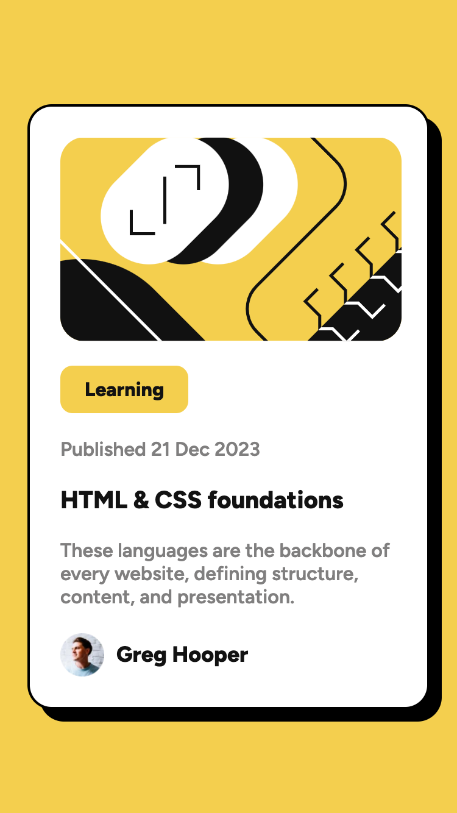

# Frontend Mentor - Blog preview card solution

This is a solution to the [Blog preview card challenge on Frontend Mentor](https://www.frontendmentor.io/challenges/blog-preview-card-ckPaj01IcS). Frontend Mentor challenges help you improve your coding skills by building realistic projects.

## Table of contents

- [Overview](#overview)
  - [The challenge](#the-challenge)
  - [Screenshot](#screenshot)
  - [Links](#links)
- [My process](#my-process)
  - [Built with](#built-with)
  - [What I learned](#what-i-learned)
  - [Continued development](#continued-development)
  - [Useful resources](#useful-resources)
- [Author](#author)

## Overview

### The challenge

Users should be able to:

- See hover and focus states for all interactive elements on the page

### Screenshot

### Links

- Solution URL: [GitHub repository](https://github.com/justinconnell/fem-blog-preview-card)
- Live Site URL: [Live site](https://justinconnell.github.io/fem-blog-preview-card/)

## My process

### Built with

- Semantic HTML5 markup
- CSS custom properties
- Flexbox
- Mobile-first workflow
- BEM

### What I learned

I learned to use flexbox more effiently to implement layout. In this chjallenge I used row-gap to space out the sections as per the design. I also applied code organisation to logically group and comment the code to improve maintainablity.

### Continued development

I signed up for [Frontend Masters](https://frontendmasters.com) and am following the CSS learning path.

### Useful resources

- [Semantic markup for card blocks](https://codereview.stackexchange.com/questions/188612/semantic-markup-for-card-blocks) - helped me to use semantic markup in a realistic context
- [Organizing your CSS](https://developer.mozilla.org/en-US/docs/Learn/CSS/Building_blocks/Organizing) - This article helped me to apply code organisation to the CSS file.

## Author

- GitHub - [Justin](https://github.com/justinconnell)
- Frontend Mentor - [@justinconnell](https://www.frontendmentor.io/profile/justinconnell)
- Twitter - [@justin2code](https://twitter.com/justin2code)
